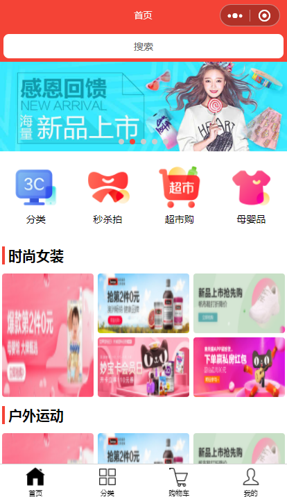
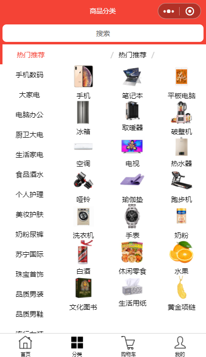
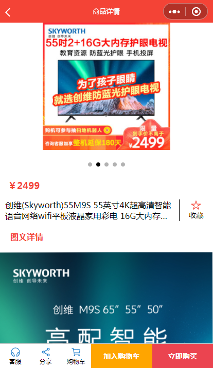
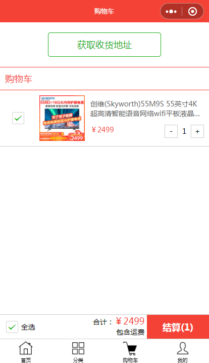
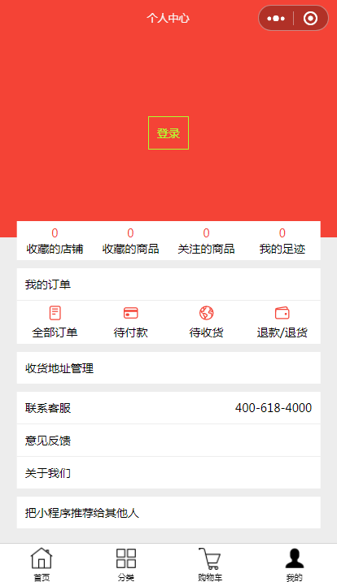

# 微信小程序商城模板
一个微信商城小程序，包含了商城首页、商品分类页面、商品详情页面、购物车页面、个人中心页面，可用于个人学习以及商业开发。
## 开发工具
- [微信开发者工具](https://developers.weixin.qq.com/miniprogram/dev/devtools/devtools.html)
## 使用
把项目下载解压或Clone到本地，然后使用微信开发者工具导入该文件夹即可。
> 注意：请在微信开发者工具的右上角找到“详情-本地设置”，开启“增强编译”，以支持ES7的async/await语法。
## 截图

## 项目许可
MIT
## 捐赠
如果本项目能对您有所帮助，欢迎打赏，以支持作者开发更多优质的项目，衷心感谢您！
